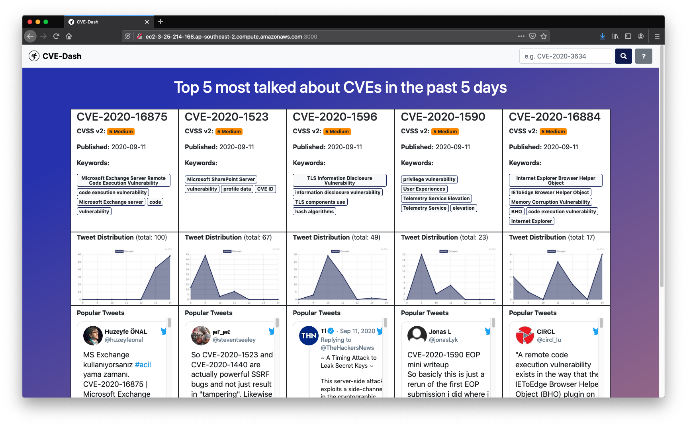

# CVE-Dash-public
CVE-Dash seeks to make keeping up to date an efficient process for cyber security professionals and other interested individuals, by using a combination of Twitter and sentiment analysis to present the most significant and talked about CVEs to a user on a weekly basis.

## Services Used
### CIRCL CVE API
The Computer Incident Response Center Luxembourg (CIRCL) operates a public web interface to their open source cve-search tool. This collects data from sources like MITRE and NIST’s National Vulnerability Database to respond to queries on OVAL definitions, Common Vulnerability Reporting Framework (CVRF) documents and CVE data. Authentication is not required and any rate limiting is not documented. Response is in JSON format.  
Endpoint: https://cve.circl.lu/api/  
Docs: https://cve.circl.lu/api/

### Twitter API v1.1
The Twitter API enables the querying and interaction with Twitter content like Tweets, Direct Messages (Twitter, n.d). The free version used in this project is rate limited to 450 requests per 15 minute window. Premium and paid services are available. Response is in JSON format.  
Endpoint: https://api.twitter.com/1.1/search/tweets.json  
Docs: https://developer.twitter.com/en/docs/twitter-api/v1

### Google Cloud’s Natural Language API
As a part of a Cloud Machine Learning service, Google Cloud offers a Natural language API for various processing, like sentiment analysis, content analysis and syntax analysis. This API is not free, however $USD300 of free credit is offered for new accounts. Requires an environment variable pointing to an API private key. Response is in JSON format.  
Endpoint: https://language.googleapis.com/v1/documents:analyzeSentiment  
Docs: https://cloud.google.com/natural-language/docs

### Image-Charts API
As the name suggests, this API is primarily for generating various types of charts based on given data sets by a client. Free but enforces a small watermark.  
Endpoint: https://image-charts.com/chart  
Docs: https://documentation.image-charts.com/
